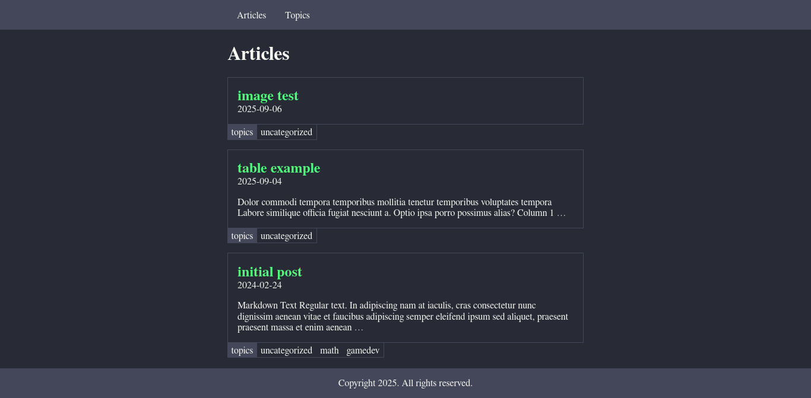
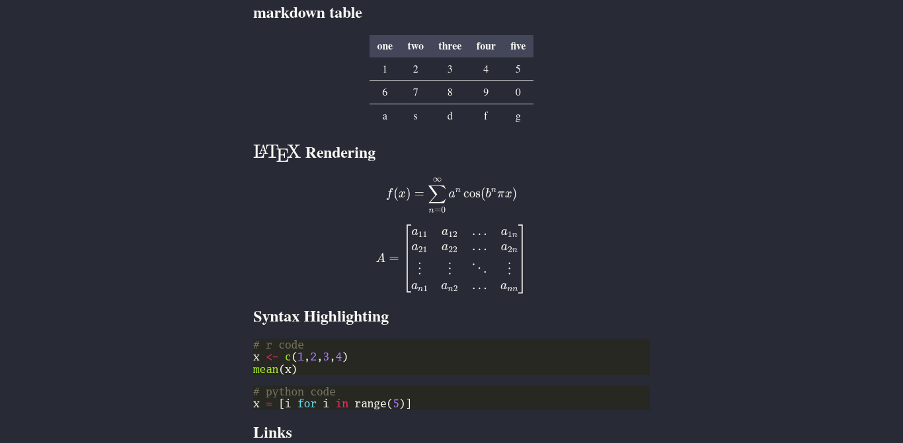

# blog25

A blog built with [hugo](https://gohugo.io/).

A rewrite of [blog](https://github.com/Clementef/blog) using [hugo-min](https://github.com/Clementef/hugo_min) as a starting point.

 | 
:-: | :-:

## Features

- topics taxonomy
- latex rendering
- syntax highlighting

## Planned Features

- table of contents styles
- reactive components with [alpine.js](https://alpinejs.dev/)
- images and figures
